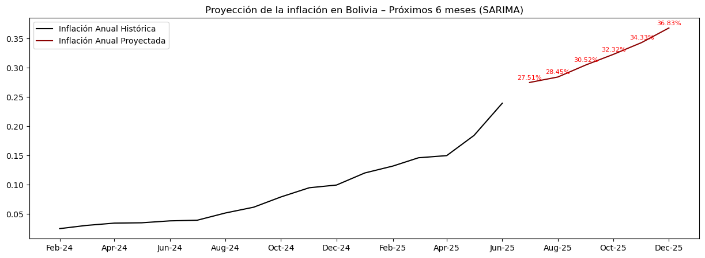

# 📊 Proyecciones de Inflación en Bolivia usando Modelos Econométricos – SARIMA

Este proyecto tiene como objetivo aplicar técnicas de econometría financiera sobre series temporales univariadas, específicamente el modelo **SARIMA**, para generar proyecciones del IPC y estimaciones de la inflación anual en Bolivia.

---

## 🎯 Objetivo del Proyecto

Aplicar un modelo estadístico para:

- Proyectar el Índice de Precios al Consumidor (IPC) de Bolivia.
- Estimar la inflación anual esperada para los siguientes 6 meses.

---

## ⚙️ Metodología

1. **Recolección de Datos**: Base histórica del IPC del INE.
2. **Limpieza y Transformación**:
3. **Tests de Estacionariedad**: ADF y análisis de varianza.
4. **Análisis ACF/PACF**: Identificación de parámetros p y q.
5. **Descomposición Estacional**: Confirmación de estacionalidad con s=12.
6. **Modelado SARIMA**:
   - Comparación entre modelo manual y `auto_arima`.
   - Selección basada en AIC y significancia.
7. **Proyección a 6 meses del IPC**.
8. **Cálculo de Inflación Anual**.

---

## 📈 Resultados

El modelo seleccionado fue:

```
SARIMA(1,1,4)(0,0,0)[12] con AIC = -3470.685
```

📉 Inflación anual proyectada para los próximos 6 meses:

| Mes          | Inflación Anual Proyectada |
|--------------|----------------------------|
| Julio 2025   | 27.51%                     |
| Agosto 2025  | 28.45%                     |
| Septiembre 2025 | 30.52%                 |
| Octubre 2025 | 32.32%                     |
| Noviembre 2025 | 34.33%                  |
| Diciembre 2025 | 36.83%                  |

---



---

## 📌 Consideraciones

> Este análisis es académico y no constituye una recomendación financiera. Toda decisión de inversión debe considerar el perfil de riesgo, el contexto regulatorio y las condiciones del mercado.

---

## 👨‍💼 Autor

**Luis Javier Quispe Ramírez**  
📧 luisquispe1@upb.edu  
🔗 [LinkedIn](https://www.linkedin.com/in/luisquispe11/)  
*Ingeniero Financiero | Apasionado por la Ciencia de Datos Aplicada a Finanzas y Predicción Económica*

---

## 💬 Agradecimiento

Agradezco cualquier sugerencia, crítica constructiva o recomendación metodológica que permita mejorar este proyecto.
